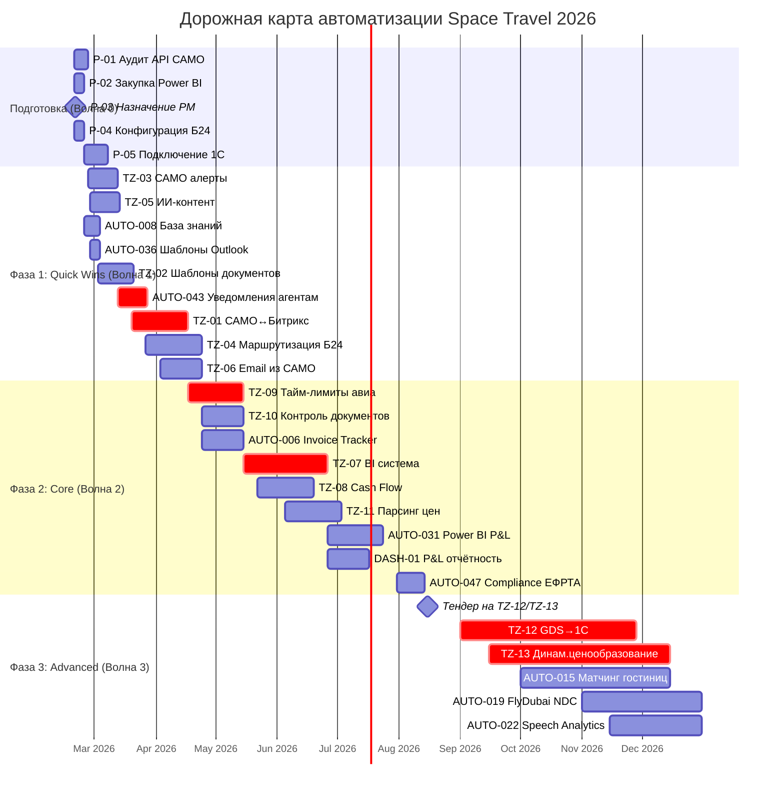
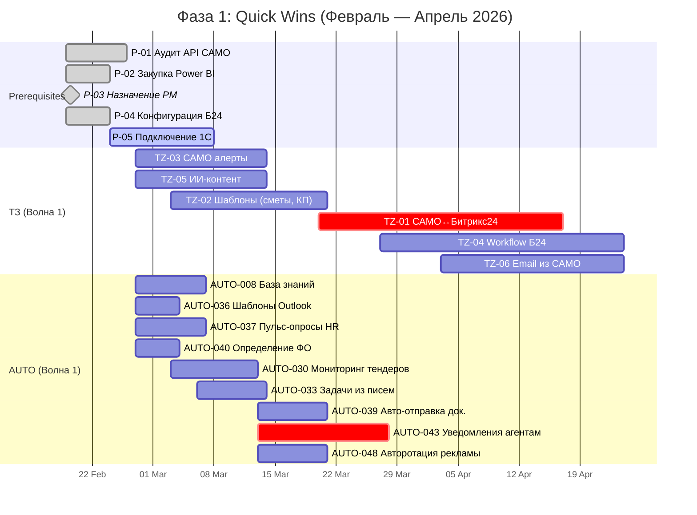
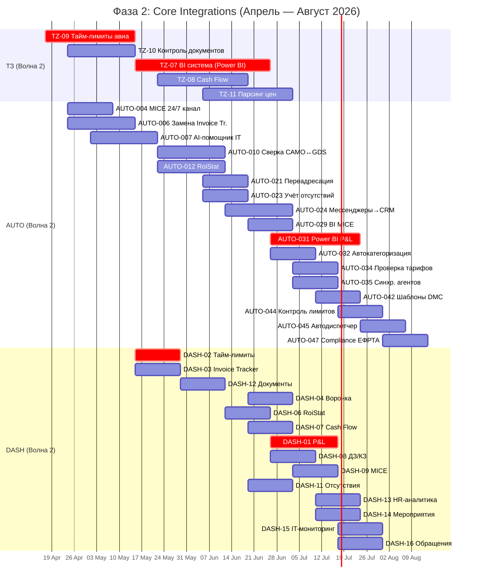
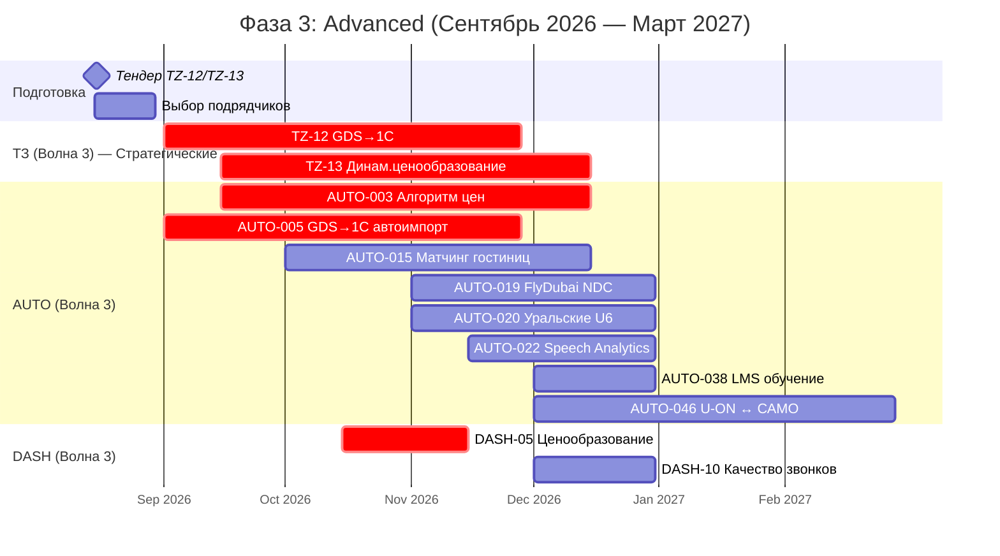
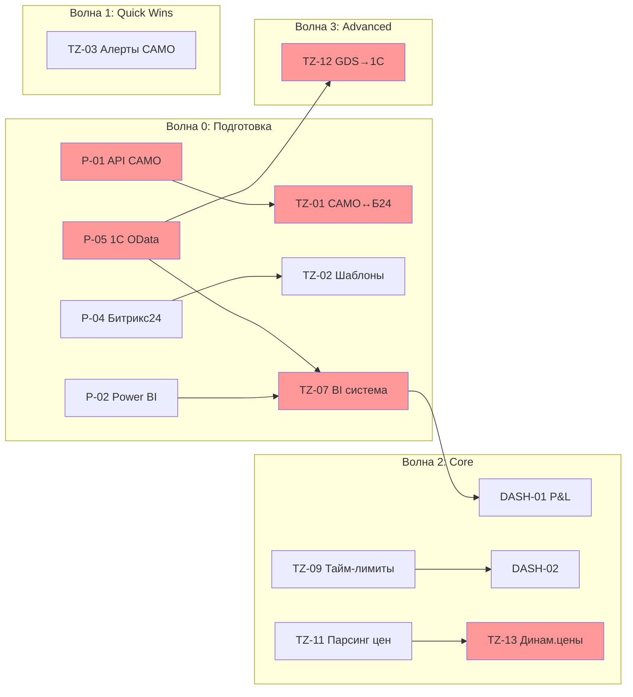

# Дорожная карта внедрения автоматизации Space Travel

**Дата:** 2026-02-19
**Версия:** 1.0
**Задача:** 4.5 Дорожная карта внедрения

---

## Резюме

| Показатель | Значение |
|------------|----------|
| **Всего инициатив** | **64** |
| Технические задания (ТЗ) | 13 |
| Автоматизации (AUTO) | 48 |
| Дашборды (DASH) | 16 |
| Prerequisites (P) | 5 |
| **Горизонт планирования** | **Февраль 2026 — Март 2027** |
| **Общий бюджет** | **~17 000 000 руб** |
| **Ожидаемый эффект** | **~18 000 000 руб/год** |

---

## Фазы внедрения

| Фаза | Период | Фокус | Инициатив | Бюджет |
|------|--------|-------|-----------|--------|
| **Подготовка** | Фев 2026 | Prerequisites | 5 | 730 000 руб |
| **Фаза 1: Quick Wins** | Фев — Апр 2026 | Быстрые победы | 18 | ~2 600 000 руб |
| **Фаза 2: Core Integrations** | Апр — Авг 2026 | Ключевые интеграции | 30 | ~5 200 000 руб |
| **Фаза 3: Advanced** | Сен — Дек 2026 | Продвинутая автоматизация | 11 | ~21 000 000 руб |

---

## Диаграмма Ганта: Общий вид

---

## Диаграмма Ганта: Фаза 1 — Quick Wins (детально)

---

## Диаграмма Ганта: Фаза 2 — Core Integrations (детально)

---

## Диаграмма Ганта: Фаза 3 — Advanced (детально)

---

## Критический путь

Критический путь — это последовательность задач, определяющая минимальный срок реализации всего проекта.

**Критические задачи (красные):**
1. **P-01** → Без аудита API САМО невозможны интеграции
2. **P-05** → Без подключения 1С невозможны BI-дашборды и GDS→1С
3. **TZ-01** → Центральная интеграция САМО↔Битрикс24
4. **TZ-07** → Единая BI-система для всей отчётности
5. **TZ-12** → Критический финансовый проект (GDS→1С)
6. **TZ-13** → Стратегическое ценообразование

---

## Распределение ресурсов по месяцам

| Месяц | IT-отдел | Подрядчики | Департаменты | Бюджет |
|-------|----------|------------|--------------|--------|
| **Февраль** | Prerequisites (P-01—P-05) | 1С OData | Все | 730 000 |
| **Март** | TZ-03, AUTO-008, 036, 040 | — | MICE, Маркетинг | 600 000 |
| **Апрель** | TZ-02, TZ-01, TZ-04 | Albato | Опер., Агентства | 1 500 000 |
| **Май** | TZ-09, TZ-10, AUTO-004, 006 | — | Опер., Кл.сервис | 1 200 000 |
| **Июнь** | TZ-07 (BI), TZ-08 | BI-подрядчик | Финансы | 2 000 000 |
| **Июль** | AUTO-031, DASH-01—08 | BI-подрядчик | Финансы, HR | 1 000 000 |
| **Август** | AUTO-044, 045, 047 | — | Агентства | 500 000 |
| **Сентябрь** | Тендер, TZ-12 старт | RPA-подрядчик | Финансы | 2 000 000 |
| **Октябрь** | TZ-13 старт | ML-подрядчик | Опер.доходы | 3 000 000 |
| **Ноябрь** | AUTO-019, 020 | NDC-подрядчик | Операционный | 2 000 000 |
| **Декабрь** | AUTO-022, 038, стабилизация | — | HR, Кл.сервис | 1 500 000 |

---

## Ключевые вехи (Milestones)

| Дата | Веха | Критерий успеха |
|------|------|-----------------|
| **19.02.2026** | Старт проекта | PM назначен, prerequisites запущены |
| **07.03.2026** | P-05 завершён | 1С подключён к выгрузкам |
| **17.04.2026** | Фаза 1 — 50% | TZ-01, TZ-02, TZ-03 внедрены |
| **24.04.2026** | Фаза 1 — завершена | 18 Quick Wins реализованы |
| **15.05.2026** | TZ-09 запущен | Контроль тайм-лимитов работает |
| **26.06.2026** | TZ-07 запущен | P&L в Power BI |
| **07.08.2026** | Фаза 2 — завершена | 30 Core интеграций реализованы |
| **15.08.2026** | Тендер объявлен | ТЗ для TZ-12, TZ-13 готовы |
| **01.09.2026** | Фаза 3 — старт | Подрядчики выбраны |
| **28.11.2026** | TZ-12 завершён | GDS→1С интеграция работает |
| **15.12.2026** | TZ-13 завершён | Динамическое ценообразование |
| **31.12.2026** | Проект завершён | Все 64 точки автоматизированы |

---

## Риски и митигация

| Риск | Вероятность | Влияние | Митигация |
|------|-------------|---------|-----------|
| API САМО недоступен | Средняя | **Критическое** | P-01 выявит до инвестиций; Contingency plan A/B/C |
| Задержка P-05 (1С) | Высокая | Высокое | Backup-подрядчик; начать TZ-07 параллельно |
| Перегрузка IT-отдела | Высокая | Среднее | Привлечение внешних подрядчиков |
| Тендер затянется | Средняя | Среднее | Начать подготовку в июле |
| Сопротивление сотрудников | Низкая | Среднее | Обучение, постепенное внедрение |

---

## Контрольные показатели (KPI)

| Показатель | Q1 2026 | Q2 2026 | Q3 2026 | Q4 2026 |
|------------|---------|---------|---------|---------|
| Точек автоматизации внедрено | 5 P + 12 AUTO | +18 AUTO | +15 AUTO | +11 AUTO |
| Накопленная экономия (ч/мес) | 150 | 500 | 900 | 1 272 |
| Бюджет освоен | 2 000 000 | 6 500 000 | 12 000 000 | 17 000 000 |
| Сотрудников обучено | 20 | 80 | 150 | 198 |

---

## Связанные документы

| Документ | Описание |
|----------|----------|
| `4.5_automation_roadmap.csv` | Таблица-план (открывается в Excel) |
| `4.4_automation_roadmap.md` | Дорожная карта v3.1 (полная) |
| `4.4_TZ_registry_and_plan.md` | Реестр 13 ТЗ |
| `4.3_ROI_summary.md` | Расчёт окупаемости |
| `4.4_critical_issues_resolved.md` | Устранение критических замечаний |

---

## Критерии успешности задачи 4.5

- [x] Все 64 инициативы распределены по фазам
- [x] Зависимости учтены (Prerequisites → TZ → AUTO/DASH)
- [x] Диаграмма Ганта готова (общая + детальные по фазам)
- [x] Критический путь определён
- [x] Ключевые вехи установлены
- [x] Риски и митигация описаны

---

*Документ создан: 2026-02-19*
*Версия: 1.0*
