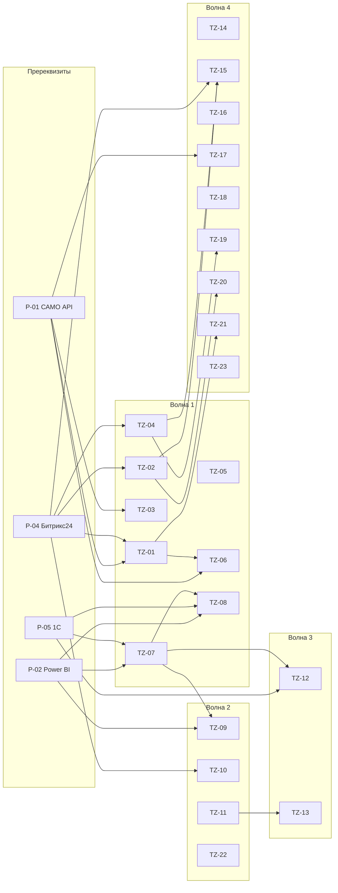

# Схема связей: 23 ТЗ ↔ 62 точки автоматизации

## Диаграмма по волнам

```mermaid
flowchart TB
    subgraph W0["🔧 ВОЛНА 0 — Пререквизиты"]
        P01["P-01<br/>Аудит API САМО"]
        P02["P-02<br/>Закупка Power BI"]
        P04["P-04<br/>Конфигурация Б24"]
        P05["P-05<br/>Подключение 1С"]
    end

    subgraph W1["🚀 ВОЛНА 1 — Quick Wins (8 ТЗ, 712 ч/мес)"]
        TZ01["TZ-01<br/>САМО ↔ Б24<br/>93 ч/мес"]
        TZ02["TZ-02<br/>Шаблоны<br/>90 ч/мес"]
        TZ03["TZ-03<br/>САМО алерты<br/>50 ч/мес"]
        TZ04["TZ-04<br/>Маршрутизация<br/>147 ч/мес"]
        TZ05["TZ-05<br/>ИИ-контент<br/>39 ч/мес"]
        TZ06["TZ-06<br/>Email САМО<br/>37 ч/мес"]
        TZ07["TZ-07<br/>BI Power BI<br/>182 ч/мес"]
        TZ08["TZ-08<br/>Cash Flow<br/>70 ч/мес"]
    end

    subgraph W2["⚠️ ВОЛНА 2 — Критические (4 ТЗ, 132 ч/мес)"]
        TZ09["TZ-09<br/>Тайм-лимиты<br/>40 ч/мес"]
        TZ10["TZ-10<br/>Документы<br/>28 ч/мес"]
        TZ11["TZ-11<br/>Парсинг цен<br/>56 ч/мес"]
        TZ22["TZ-22<br/>Регуляторный<br/>8 ч/мес"]
    end

    subgraph W3["🎯 ВОЛНА 3 — Стратегические (2 ТЗ, 191 ч/мес)"]
        TZ12["TZ-12<br/>GDS → 1С<br/>81 ч/мес"]
        TZ13["TZ-13<br/>Динам. цены<br/>110 ч/мес"]
    end

    subgraph W4["📈 ВОЛНА 4 — Развитие (9 ТЗ, 323 ч/мес)"]
        TZ14["TZ-14<br/>Авиа API<br/>49 ч/мес"]
        TZ15["TZ-15<br/>AI-помощники<br/>81 ч/мес"]
        TZ16["TZ-16<br/>RoiStat<br/>33 ч/мес"]
        TZ17["TZ-17<br/>Матчинг отелей<br/>50 ч/мес"]
        TZ18["TZ-18<br/>HR-платформа<br/>38 ч/мес"]
        TZ19["TZ-19<br/>Мессенджеры<br/>28 ч/мес"]
        TZ20["TZ-20<br/>Тендеры/DMC<br/>20 ч/мес"]
        TZ21["TZ-21<br/>Франчайзинг<br/>17 ч/мес"]
        TZ23["TZ-23<br/>IT-мониторинг<br/>7 ч/мес"]
    end

    %% Зависимости от пререквизитов
    P01 --> TZ01
    P01 --> TZ03
    P01 --> TZ06
    P04 --> TZ01
    P04 --> TZ02
    P04 --> TZ04
    P02 --> TZ07
    P05 --> TZ07
    P02 --> TZ08
    P05 --> TZ08

    %% Зависимости между ТЗ
    TZ01 --> TZ06
    TZ07 --> TZ08
    TZ07 --> TZ09
    TZ11 --> TZ13
    TZ02 --> TZ15
    TZ04 --> TZ15
    TZ02 --> TZ20
    TZ04 --> TZ19
    TZ01 --> TZ21
```



---

## Таблица связей: ТЗ → AUTO-точки

| Волна | ТЗ | AUTO-точки | Кол-во | Экономия |
|-------|-----|------------|--------|----------|
| **1** | TZ-01 | AUTO-035, 039, 043, 044 | 4 | 93 ч/мес |
| **1** | TZ-02 | AUTO-013, 025, 027, 036 | 4 | 90 ч/мес |
| **1** | TZ-03 | AUTO-016, 017, 034 | 3 | 50 ч/мес |
| **1** | TZ-04 | AUTO-009, 021, 033, 040, 041, 045, DASH-16 | 7 | 147 ч/мес |
| **1** | TZ-05 | AUTO-026, 048 | 2 | 39 ч/мес |
| **1** | TZ-06 | AUTO-011, 028 | 2 | 37 ч/мес |
| **1** | TZ-07 | AUTO-006, 029, 031, DASH-01, 03, 04, 08, 09, 13, 14 | 10 | 182 ч/мес |
| **1** | TZ-08 | AUTO-014, 032, DASH-07 | 3 | 70 ч/мес |
| **2** | TZ-09 | AUTO-001, DASH-02 | 2 | 40 ч/мес |
| **2** | TZ-10 | AUTO-002, DASH-12 | 2 | 28 ч/мес |
| **2** | TZ-11 | AUTO-018, DASH-05 | 2 | 56 ч/мес |
| **2** | TZ-22 | AUTO-047 | 1 | 8 ч/мес |
| **3** | TZ-12 | AUTO-005 | 1 | 81 ч/мес |
| **3** | TZ-13 | AUTO-003, DASH-05 | 2 | 110 ч/мес |
| **4** | TZ-14 | AUTO-010, 019, 020 | 3 | 49 ч/мес |
| **4** | TZ-15 | AUTO-004, 007, 008 | 3 | 81 ч/мес |
| **4** | TZ-16 | AUTO-012, DASH-06 | 2 | 33 ч/мес |
| **4** | TZ-17 | AUTO-015 | 1 | 50 ч/мес |
| **4** | TZ-18 | AUTO-023, 037, 038, DASH-11 | 4 | 38 ч/мес |
| **4** | TZ-19 | AUTO-024 | 1 | 28 ч/мес |
| **4** | TZ-20 | AUTO-030, 042 | 2 | 20 ч/мес |
| **4** | TZ-21 | AUTO-046 | 1 | 17 ч/мес |
| **4** | TZ-23 | DASH-15 | 1 | 7 ч/мес |
| | **ИТОГО** | **62 точки** | **62** | **1 358 ч/мес** |

---

## Граф зависимостей между ТЗ



---

## Визуальная карта AUTO-точек по департаментам

```
┌─────────────────────────────────────────────────────────────────────────────┐
│                        62 ТОЧКИ АВТОМАТИЗАЦИИ                               │
├─────────────────────────────────────────────────────────────────────────────┤
│                                                                             │
│  ┌─── ОПЕРАЦИОННЫЙ (Преображенская) ───┐    ┌─── ФИНАНСЫ (Назарикова) ───┐ │
│  │ TZ-04: AUTO-009,021,033,040,041,045 │    │ TZ-07: AUTO-006,029,031    │ │
│  │ TZ-09: AUTO-001                      │    │        DASH-01,03,04,08   │ │
│  │ TZ-10: AUTO-002                      │    │ TZ-08: AUTO-014,032       │ │
│  │ TZ-14: AUTO-010,019,020              │    │ TZ-12: AUTO-005           │ │
│  └──────────────────────────────────────┘    │ TZ-22: AUTO-047           │ │
│                                              └────────────────────────────┘ │
│  ┌─── ПРОДУКТ (Баландина) ─────────────┐    ┌─── АГЕНТСТВА (Мурадян) ────┐ │
│  │ TZ-03: AUTO-016,017,034             │    │ TZ-01: AUTO-035,039,043,044│ │
│  │ TZ-11: AUTO-018                     │    │ TZ-21: AUTO-046            │ │
│  │ TZ-13: AUTO-003                     │    └────────────────────────────┘ │
│  │ TZ-17: AUTO-015                     │                                   │
│  └─────────────────────────────────────┘    ┌─── HR (Жигалина) ──────────┐ │
│                                              │ TZ-18: AUTO-023,037,038    │ │
│  ┌─── MICE (Питуркин) ─────────────────┐    └────────────────────────────┘ │
│  │ TZ-02: AUTO-013,025,027,036         │                                   │
│  │ TZ-20: AUTO-030,042                 │    ┌─── IT (Логвинов) ──────────┐ │
│  └─────────────────────────────────────┘    │ TZ-15: AUTO-004,007,008    │ │
│                                              │ TZ-23: DASH-15             │ │
│  ┌─── КЛИЕНТСКИЙ СЕРВИС (Акопова) ─────┐    └────────────────────────────┘ │
│  │ TZ-15: AUTO-004,007,008             │                                   │
│  │ TZ-19: AUTO-024                     │    ┌─── МАРКЕТИНГ (вакансия) ───┐ │
│  └─────────────────────────────────────┘    │ TZ-05: AUTO-026,048        │ │
│                                              │ TZ-06: AUTO-011,028        │ │
│                                              │ TZ-16: AUTO-012            │ │
│                                              └────────────────────────────┘ │
└─────────────────────────────────────────────────────────────────────────────┘
```

---

## Сводка

| Показатель | Значение |
|------------|----------|
| Всего ТЗ | **23** |
| Всего AUTO-точек | **62** (47 процессных + 15 дашбордов) |
| Волна 1 (Quick Wins) | 8 ТЗ, 35 точек, 712 ч/мес |
| Волна 2 (Критические) | 4 ТЗ, 7 точек, 132 ч/мес |
| Волна 3 (Стратегические) | 2 ТЗ, 3 точки, 191 ч/мес |
| Волна 4 (Развитие) | 9 ТЗ, 17 точек, 323 ч/мес |
| **Общая экономия** | **1 358 ч/мес (~14.8 млн ₽/год)** |
