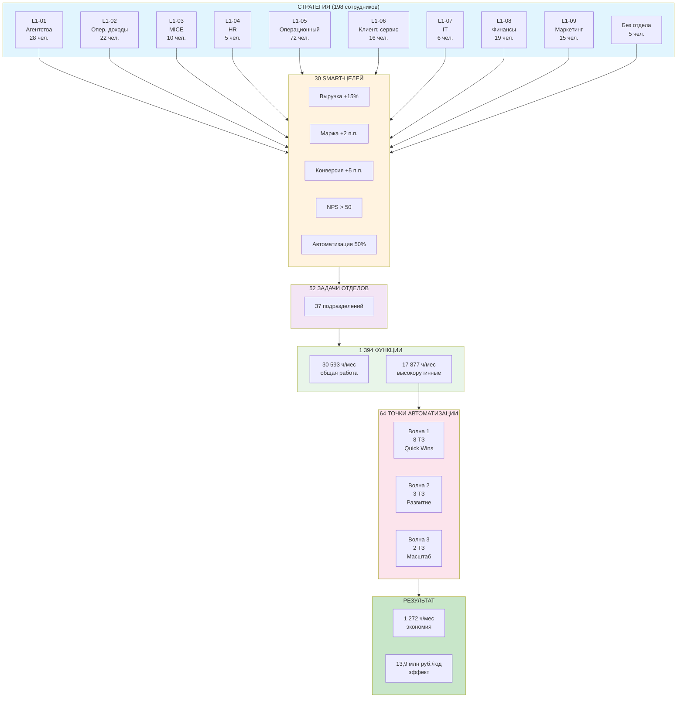

# Навигационная карта проекта Space Travel

## Иерархия: от стратегии до результата

```
┌─────────────────────────────────────────────────────────────────────────────┐
│                                                                             │
│  ╔═══════════════════════════════════════════════════════════════════════╗  │
│  ║  УРОВЕНЬ 1: ОРГАНИЗАЦИЯ                                               ║  │
│  ╠═══════════════════════════════════════════════════════════════════════╣  │
│  ║                                                                       ║  │
│  ║    9 ДЕПАРТАМЕНТОВ → 37 ОТДЕЛОВ → 198 СОТРУДНИКОВ                     ║  │
│  ║         (L1)            (L2)      (9 L1 + 37 L2 + 152 L3)             ║  │
│  ║                                                                       ║  │
│  ╚═══════════════════════════════════════════════════════════════════════╝  │
│                                    │                                        │
│                                    ▼                                        │
│  ╔═══════════════════════════════════════════════════════════════════════╗  │
│  ║  УРОВЕНЬ 2: ЦЕЛИ И ЗАДАЧИ                                             ║  │
│  ╠═══════════════════════════════════════════════════════════════════════╣  │
│  ║                                                                       ║  │
│  ║    30 ЦЕЛЕЙ → 52 ЗАДАЧИ → 1 394 ФУНКЦИИ                               ║  │
│  ║     (SMART)      (L2)         (L3)                                    ║  │
│  ║                                                                       ║  │
│  ╚═══════════════════════════════════════════════════════════════════════╝  │
│                                    │                                        │
│                                    ▼                                        │
│  ╔═══════════════════════════════════════════════════════════════════════╗  │
│  ║  УРОВЕНЬ 3: ДОКУМЕНТАЦИЯ                                              ║  │
│  ╠═══════════════════════════════════════════════════════════════════════╣  │
│  ║                                                                       ║  │
│  ║    8 БИЗНЕС-ПРОЦЕССОВ → 69 РЕГЛАМЕНТОВ → 198 ДОЛЖН. ИНСТРУКЦИЙ        ║  │
│  ║          (BP)              (готово)          (Этап 6)                 ║  │
│  ║                                                                       ║  │
│  ╚═══════════════════════════════════════════════════════════════════════╝  │
│                                    │                                        │
│                                    ▼                                        │
│  ╔═══════════════════════════════════════════════════════════════════════╗  │
│  ║  УРОВЕНЬ 4: АВТОМАТИЗАЦИЯ                                             ║  │
│  ╠═══════════════════════════════════════════════════════════════════════╣  │
│  ║                                                                       ║  │
│  ║    13 ТЗ (разработаны) ────────────► 64 ТОЧКИ АВТОМАТИЗАЦИИ           ║  │
│  ║                                                                       ║  │
│  ╚═══════════════════════════════════════════════════════════════════════╝  │
│                                    │                                        │
│                                    ▼                                        │
│  ╔═══════════════════════════════════════════════════════════════════════╗  │
│  ║  УРОВЕНЬ 5: РЕЗУЛЬТАТ                                                 ║  │
│  ╠═══════════════════════════════════════════════════════════════════════╣  │
│  ║                                                                       ║  │
│  ║              1 272 ч/мес экономия → 13,9 МЛН ₽/ГОД                     ║  │
│  ║                    (NET, после внедрения)                             ║  │
│  ║                                                                       ║  │
│  ╚═══════════════════════════════════════════════════════════════════════╝  │
│                                                                             │
└─────────────────────────────────────────────────────────────────────────────┘
```

---

## Штат по департаментам (верифицировано)

| ID | Департамент | Руководитель | L1 | L2 | L3 | Всего |
|----|-------------|--------------|----|----|-----|-------|
| L1-01 | Агентства | Мурадян О.Ю. | 1 | 11 | 16 | **28** |
| L1-02 | Опер. доходы | Баландина О.А. | 1 | 6 | 15 | **22** |
| L1-03 | MICE | Питуркин С.А. | 1 | 4 | 5 | **10** |
| L1-04 | HR | Жигалина Ю.А. | 1 | 0 | 4 | **5** |
| L1-05 | Операционный | Преображенская Т.В. | 1 | 5 | 66 | **72** |
| L1-06 | Клиент. сервис | Акопова А.В. | 1 | 2 | 13 | **16** |
| L1-07 | IT | Логвинов Г.А. | 1 | 0 | 5 | **6** |
| L1-08 | Финансы | Назарикова М.В. | 1 | 5 | 13 | **19** |
| L1-09 | Маркетинг | *вакансия* | 1 | 3 | 11 | **15** |
| — | Без отдела | — | 0 | 1 | 4 | **5** |
| | **ИТОГО** | | **9** | **37** | **152** | **198** |

> **Источник:** `сводный_список_сотрудников_Спейс_тревел.xlsx`

---

## Ключевая формула (5 уровней)

```
┌─────────────────────────────────────────────────────────────────────────────────────┐
│                                                                                     │
│  УР.1  ОРГАНИЗАЦИЯ:    9 департаментов → 37 отделов → 198 сотрудников              │
│                             (L1)            (L2)      (9 L1 + 37 L2 + 152 L3)      │
│                                             │                                       │
│                                             ▼                                       │
│  УР.2  ЦЕЛИ И ЗАДАЧИ:  30 целей → 52 задачи → 1 394 функции                        │
│                         (SMART)      (L2)         (L3)                             │
│                                             │                                       │
│                                             ▼                                       │
│  УР.3  ДОКУМЕНТАЦИЯ:   8 бизнес-процессов → 69 регламентов → 198 должн. инструкций │
│                              (BP)              (готово)          (Этап 6)          │
│                                             │                                       │
│                                             ▼                                       │
│  УР.4  АВТОМАТИЗАЦИЯ:  13 ТЗ (разработаны) ────────► 64 точки автоматизации        │
│                                             │                                       │
│                                             ▼                                       │
│  УР.5  РЕЗУЛЬТАТ:      1 272 ч/мес экономия ────────► 13,9 млн ₽/год               │
│                                                                                     │
└─────────────────────────────────────────────────────────────────────────────────────┘
```

### Расшифровка

| Элемент | Кол-во | Статус | Файлы |
|---------|--------|--------|-------|
| Департаменты | 9 | ✅ | `L1_json/` |
| SMART-цели | 30 | ✅ | `goals/1.2_L1_goals_SMART.json` |
| Задачи отделов | 52 | ✅ | `goals/1.2_L2_goals_SMART.json` |
| Функции L3 | 1 394 | ✅ | `L3_json/` (150 анкет) |
| Бизнес-процессы | 8 | ✅ | `processes/2.3_BP_*.md` |
| Регламенты | 69 | ✅ | `processes/5.0_regulations_registry.md` |
| Должностные инструкции | 198 | ⬜ | Этап 6 (разработать) |
| Точки автоматизации | 64 | ✅ | `tz/TZ_01–13` |
| Экономия | 13,9 млн ₽/год | ✅ | NET после внедрения |

---

## Детализация по уровням

| Уровень | Что это | Кол-во | Источник |
|---------|---------|--------|----------|
| **L1** | Директора департаментов | 9 | Анкеты L1 (9 файлов) |
| **L2** | Руководители отделов | 37 | Анкеты L2 (39 файлов) |
| **L3** | Исполнители | 152 | Анкеты L3 (150 файлов) |
| | **Всего сотрудников** | **198** | Сводный список |
| | | | |
| **Цели** | SMART-цели L1 | 30 | `goals/1.2_L1_goals_SMART.json` |
| **Задачи** | Задачи отделов L2 | 52 | `goals/1.2_L2_goals_SMART.json` |
| **Функции** | Операции L3 | 1 394 | `automation/4.4_AUTO_to_L3_mapping.md` |
| **AUTO** | Точки автоматизации | 64 | `automation/3.4_automation_potential.md` |

---

## Пример полной цепочки (департамент «Операционный»)

```
L1-05: ОПЕРАЦИОННЫЙ ДЕПАРТАМЕНТ (Преображенская Т.В., 72 чел.)
│
├── ЦЕЛЬ 1: Конверсия обращений +5 п.п. (25% → 30%)
│   │
│   ├── ЗАДАЧА L2-25: Ускорить ответ до 2 часов
│   │   │
│   │   ├── Функция: Обработка входящих ──────────► AUTO-033 Задачи из писем
│   │   ├── Функция: Подбор вариантов
│   │   └── Функция: Расчёт стоимости ────────────► AUTO-002 Шаблоны смет
│   │
│   └── ЗАДАЧА L2-26: Допродажи +5%
│       │
│       ├── Функция: Предложение страховок
│       └── Функция: Предложение трансферов
│
├── ЦЕЛЬ 2: SLA 90%
│   │
│   └── ЗАДАЧА L2-24: Контроль тайм-лимитов
│       │
│       └── Функция: Мониторинг билетов ──────────► AUTO-001 Тайм-лимиты авиа
│
└── ЦЕЛЬ 3: Допродажи 12% выручки
    │
    └── ЗАДАЧА L2-23: VIP-сервис
        │
        └── Функция: Персональное сопровождение
```

---

## Принцип: каждая AUTO-точка привязана к цели

```
AUTO-001 (Тайм-лимиты авиа)
    │
    └── Функции L3: 67 задач, 34 сотрудника
        │
        └── Задачи L2: Контроль выписки, Минимизация штрафов
            │
            └── Цели L1: Снижение потерь, Рост маржи
                │
                └── Департаменты: L1-05 (Операционный), L1-08 (Финансы)
```

---

## Ключевые метрики

| Показатель | Значение | Комментарий |
|------------|----------|-------------|
| Сотрудников | 198 | 9 L1 + 37 L2 + 152 L3 |
| Общая работа компании | 30 593 ч/мес | Все функции L3 |
| Высокорутинные задачи | 17 877 ч/мес | 58% — кандидаты на автоматизацию |
| Охват 64 точками AUTO | 1 966 ч/мес | 6% работы (Quick Wins) |
| Экономия после внедрения | 1 272 ч/мес | NET-экономия |
| Финансовый эффект | 13,9 млн ₽/год | Дифференцированные ставки L1/L2/L3 |

---

## Как читать эту карту

1. **Сверху вниз** — каскадирование от стратегии к операциям
2. **Снизу вверх** — обоснование автоматизации через бизнес-цели
3. **Горизонтально** — связи между департаментами (389 взаимодействий)

---

## Визуализация потока (flowchart)



---

## Компактная версия (для слайда)

```
╔════════════════════════════════════════════════════════════════════════════════╗
║                                                                                ║
║  УР.1  ОРГАНИЗАЦИЯ     9 департаментов → 37 отделов → 198 сотрудников          ║
║                                          │                                     ║
║  УР.2  ЦЕЛИ И ЗАДАЧИ   30 целей → 52 задачи → 1 394 функции                    ║
║                                          │                                     ║
║  УР.3  ДОКУМЕНТАЦИЯ    8 БП → 69 регламентов → 198 должн. инструкций           ║
║                                          │                                     ║
║  УР.4  АВТОМАТИЗАЦИЯ   13 ТЗ ─────────► 64 точки                               ║
║                                          │                                     ║
║  УР.5  РЕЗУЛЬТАТ       1 272 ч/мес ────► 13,9 МЛН ₽/ГОД                        ║
║                                                                                ║
╚════════════════════════════════════════════════════════════════════════════════╝
```

---

*Версия 3.0 | Обновлено: 2026-02-23 | Верифицировано по сводному списку сотрудников*
